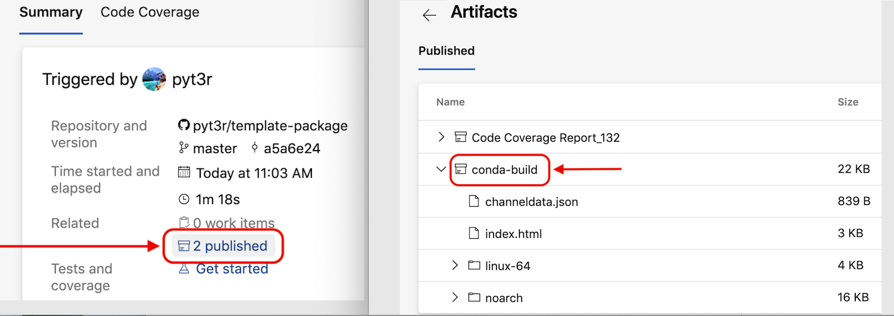

=============================================================
pyswark
=============================================================

...

.. badges

.. list-table::
    :stub-columns: 1
    :widths: 10 90

    * - docs
      - |docs|
    * - tests
      - |build| |coverage|
    * - package
      - |version| |platform| |downloads|

.. |docs| image:: https://readthedocs.org/projects/pyswark-package/badge/?version=latest
    :target: `Read the Docs`_
    :alt: Docs

.. |build| image:: https://img.shields.io/azure-devops/build/pyt3r/pyswark/3
    :alt: Build
    :target: `Azure Pipeline`_

.. |coverage| image:: https://img.shields.io/azure-devops/coverage/pyt3r/pyswark/3
    :alt: Coverage
    :target: `Azure Pipeline`_

.. |version| image:: https://img.shields.io/conda/v/pyt3r/pyswark
    :alt: Version
    :target: `Anaconda Cloud`_

.. |platform| image:: https://img.shields.io/conda/pn/pyt3r/pyswark
    :alt: Platform
    :target: `Anaconda Cloud`_

.. |downloads| image:: https://img.shields.io/conda/dn/pyt3r/pyswark
    :alt: Platform
    :target: `Anaconda Cloud`_

.. end badges

.. links

.. _conda-build: https://docs.conda.io/projects/conda-build/en/latest/
.. _Azure Pipeline: https://dev.azure.com/pyt3r/pyswark/_build
.. _Anaconda Cloud: https://anaconda.org/pyt3r/pyswark
.. _Read the Docs: https://pyswark-package.readthedocs.io

.. _(mini)conda: https://docs.conda.io/en/latest/miniconda.html
.. _conda-recipe/meta.yaml: conda-recipe/meta.yaml
.. _azure-pipelines.yml: azure-pipelines.yml
.. _https://dev.azure.com/pyt3r/pyswark/_build: https://dev.azure.com/pyt3r/pyswark/_build
.. _https://anaconda.org/pyt3r/pyswark: https://anaconda.org/pyt3r/pyswark
.. _.readthedocs.yml: .readthedocs.yml
.. _https://pyswark-package.readthedocs.io: https://pyswark-package.readthedocs.io
.. _MIT License: LICENSE

.. end links

.. contents:: :local:

Features
################

* TBD

Prerequisites
################

* `(mini)conda`_
* python3.8+
* Unix

Azure Builds
################

Each commit (and PR) to the master branch invokes the `azure-pipelines.yml`_ script, which automates Steps 1 through 3 below.

1. Create and activate a conda environment::

    $ make test-env
    $ conda activate test-env

2. Build and add the template package to the environment::

    (test-env) $ make conda-package

3. Run the tests against the template package and view the report::

    (test-env) $ make test-package

The Azure pipeline concludes by publishing the coverage report and conda package artifact to: `https://dev.azure.com/pyt3r/template/_build`_

Users may now access and upload the conda artifact to Anaconda Cloud.  The current build is published to: `https://anaconda.org/pyt3r/template`_

4. (Optional) Upload the artifact (requires an Anaconda account)::

    (test-env) $ anaconda upload ./template*.tar.bz2

   Once uploaded, the package may be installed as follows::

    $ conda install -c pyt3r template

Read The Docs
################

Each commit (and PR) to the master branch will also invoke the `.readthedocs.yml`_ script to build the documentation.

Upon a successful build, the resulting html artifact is deployed to: `https://template-package.readthedocs.io`_

Author
################

* ``pyt3r``

License
################

* `MIT License`_
